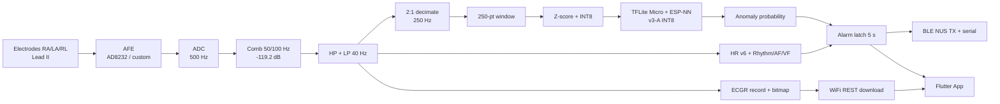

# ESP32-ECG — Portable ECG Acquisition & On-device AI Anomaly Detection

> **ESP32-S3 · ESP-IDF · TFLite Micro + ESP-NN · v3-A INT8 · BLE NUS · Flutter**  
> English | [中文](README.md)

**Portable single-lead (Lead II) ECG acquisition with on-device deep-learning beat-level anomaly detection.** 500 Hz sampling; filtering, heart-rate detection and anomaly inference run on the chip; alarms are pushed to a Flutter app over BLE, and recordings are stored on-board in the ECGR format with WiFi download support.

> **P0 protocol layer (2026-09-14)**: protocol/ecg_proto.json single source of truth + generated firmware/App/Web constants + four-end golden tests. BLE v2 HELLO + 10th asrc column, backward compatible. ECGR v2 dual-version + unified tolerant truncation. Metadata de-hardcoded via STATUS. Evidence: TUNING_HISTORY 115, protocol/README.md.
>
> **Firmware status (2026-09-01)**: the **official firmware is the ESP-IDF migration project** `experiments/esp_idf_ecg_migration/` (promoted 2026-08-28; AI/storage/WiFi/BLE/heart-rate/rule components plus the recorder chain). The legacy **Arduino + PlatformIO** line is archived under `legacy_arduino/` for reference only.
>
> **Round-H (2026-09-14, LEADOFF alarm source)**: real electrode disconnects (user-tested: zero alarm) slipped through all four existing sources because a pulled lead is an *energetic bad signal*, not silence — artifact "beats" keep resetting the 4s flatline window while SQI collapse gates the AI source off. A fifth source `ALARM_SRC_LEADOFF`(0x10) closes the gap with two criteria: **A silent** (3s rolling RMS of the analysis chain < 0.05 mV for ≥2s — mains pickup is annihilated by the comb filter and lands here too) and **B noisy** (≥8 qualifying seconds out of 10: RMS in the detach band [0.05, 0.25] plus either per-second min-SQI < 0.70 **regardless of artifact beats** or [beat-free and crest < 3.2]). VF is triple-isolated (RMS ceiling + SQI + vf-suspect suppression); the walking-equivalent negative (carrier + motion at 0dB SNR) stays at zero alarms. All thresholds are corpus- and board-calibrated (new corpus seg34..40, 7 cases x 60s, existing 31 cases byte-identical). Alarm release now additionally requires beats to return. A disclosed blind spot remains for continuous mid-band noise where the SQI primitive saturates (TH §114).
>
> **Round-F (2026-09-13, inference decoupling + 160 MHz re-adopted)**: AI inference moved to a dedicated task on core 1 (window hand-off queue with drop telemetry) and the sample loop now uses absolute-deadline pacing - **steady-state sampling restored from ~467 Hz to exactly 500 Hz** (TICK median 1.000 s); ovr dropped from 1/window to rare stalls (clock-independent), so the **160 MHz CPU clock is re-adopted on new evidence** (33% clock cut; the slower invoke is absorbed by the async budget). Two bugs fixed en route: the xTaskDelayUntil re-anchor trap (a future prev is treated as tick wrap-around and never delays) and the VF detector false-latching at true 250 Hz cadence (VF alone is now telemetry-only, requiring AI/rule corroboration; the M1-era VF board validation had never run at true cadence). Recording-stall treatment (Round-G): async stop finalization (core-1 worker + SPIFFS mutex) plus boot-time-only retention cut the stop-window sampling stall from 0.8-2.2 s to 0.5 s; the remainder is the flash-transaction global-cache-disable constraint of the finalize write itself - the true fix is sampling decoupling (timer ISR, Round-H candidate) (TH 113).
>
> **Round-E (2026-09-13, phase protocol + VF gate)**: a phase-dense evaluation protocol (30 cases x 1250 windows) shows normal-carrier FP is phase-uniform (~14% operating-point floor) and the PTB test abnormal record already detects at 95%+ across phases — killing the phase-augmentation motive before wasting a training cycle. Firmware adds a **VF rms >= 0.05 mV floor**: the physically meaningless asrc 0x08 marking on a dead wire is gone (0/57 ticks) while VF-domain-amplitude signals are unaffected (synthetic probe 0.36 mV); corpus grows to 31 cases (+synthetic_vf_probe; existing cases byte-identical by MD5) (TH §111).
>
> **Round-D (2026-09-13, erratum + negative result + firmware gate)**: (1) Erratum — the corpus "ludb_normal" carrier is actually a **PTB test-record with ground-truth label=1** (patient001/s0010_re; 51/51 beats detected), so the earlier "cross-DB 93% false-positive" reading was wrong: it was a correct detection (TH §109). (2) Pure-noise hard-negative retrain v3-N fixed pure-motion FP (0.96→0.00) but degraded clean test again (MIT evF1 -0.235) — the third and final strike for augmentation; **v3-A is retained**. (3) Firmware mitigation shipped: the AI-density alarm source now requires **min-SQI ≥ 0.80**; on-device verification shows the pure-motion latch 0.767→0 while all TP cases, the flatline rule path, and the 5-min normal regression are unchanged (TH §110).
>
> **Noise-robustness round (2026-09-12/13, M2-M4)**: a 30-case on-board noise corpus (MIT-100/106 carriers x 5 synthetic noise types x SNR 0/10/20dB + electrode-off/ADC-quant + pure noise + external-DB probes; `REPLAY 3..32`, 16MB-flash builds only) with board<->PC agreement 0.934. Findings: motion artifact reads as pathology (90% raw FP, 77% latch); noise-retrained candidate v3-B failed the swap gate three times (noisy corpus better everywhere, but clean-test event F1 -0.15~-0.23) — **v3-A is retained**; conclusions page and figures: `research/M4_结论.md` (TH §106-§110).
>
> **Alarm persistence fix (2026-09-12, M1 validated on device)**: the BLE alarm column now reflects a firmware-side **latched alarm state** — any physiological source (sustained AI density / rule-based asystole-brady-tachy / time-based asystole i.e. electrode-off / VF-VT) latches the flag for ≥30s. Before vs after (MIT-106, 90s of continuous pathology): longest alarm stretch **1s → 70s**; 5 minutes of normal replay (MIT-100) produced **zero false latches**; the flatline segment (unplugged-lead simulation) yields a 67s continuous alarm plus automatic recording. The rule channels (rs/vf) whose results were previously discarded are now wired in. A **UART/USB command channel** mirroring the BLE command set plus MODE/REPLAY/STATUS enables fully automated pc_tools-driven testing without reflashing (TUNING_HISTORY §105).
>
> **Power pass + first board run (2026-09-12, M0 validated on device)**: -Og→-O2, two-stage BLE advertising (fast 60 s → ~1 s slow), idle connection-interval stretch when notifications are off, display filter skipped while disconnected; TICK gains busy%/ovr telemetry. **CPU stays at 240 MHz**: the 160 MHz build showed the same ovr signature as 240 on device (one structural timeout per window caused by in-loop AI inference, not a clock-margin issue), so per the acceptance gate it was reverted (TUNING_HISTORY §104). Also fixed a main-task stack overflow on v3-A's first board run (3584→8192; TFLM inference runs inside the main task). WiFi AP still starts at boot (on-demand switching needs an app-side WIFI_ON entry, not done).

---

## Features

| Area | Details |
|------|---------|
| Acquisition | 500 Hz, 3-channel (clean / noisy / filtered); sources: simulator, real AFE, MIT-BIH replay |
| Filtering | Two-stage comb (50/100 Hz nulling, -119.2 dB) → HP → LP 40 Hz |
| Heart rate | Energy-envelope QRS detector v6 (LUDB: F1 0.868, Se 96.4%, BPM MAE 4.16) |
| AI | v3-A ResNet-L INT8 (167,376 B); TFLite Micro + ESP-NN inference; beat-level anomaly detection |
| Rhythm | Asystole / bradycardia / tachycardia (rules), AF (CV+entropy), VF/VT (DSP features + LR) |
| Alarm | 5 s latch; `abnormal` flag + per-second bitmap over BLE/serial |
| Recording | ECGR format (32 B header + int16 stream + 1 B/s abnormal bitmap); auto-record on anomaly; WiFi REST download |
| Communication | BLE NUS (TX/RX) + WiFi HTTP; Flutter app on mobile |

---

## Quick Start

```bash
# —— Official firmware (ESP-IDF v6) ——
cd experiments/esp_idf_ecg_migration
idf.py build              # build
idf.py -p <PORT> flash    # flash
idf.py monitor            # serial monitor

# —— Legacy Arduino line (reference only) ——
cd legacy_arduino && pio run

# —— PC plotting / mobile app ——
python pc_tools/ecg_plotter.py
cd ecg_app && flutter run
```

> ⚠️ AI model training requires a GPU (WSL2).

---

## Architecture



- **Core assignment**: Core 1 = acquisition/filtering/comms/storage; Core 0 = AI inference (250-pt window, AI_STRIDE=250).
- **Pipeline**: 500 Hz → causal filtering → 2:1 decimation → 250-pt window → normalization → INT8 → inference → dequantized anomaly probability.

---

## Directory Layout

```
experiments/esp_idf_ecg_migration/  # official ESP-IDF firmware line
  main/                            # main (sampling/filter/HR/alarm/record/BLE/WiFi)
  components/                      # ecg_ai · ecg_core · ecg_ble · ecg_wifi · ecg_storage · ecg_afe
                                   # + esp-tflite-micro · esp-nn (vendored)
legacy_arduino/                    # legacy Arduino/PlatformIO line (archived)
pc_tools/                          # PC tools: ecg_plotter + ecg_dl (train/eval/export)
ecg_app/                           # Flutter mobile app
web/                               # web recording-download frontend
docs/                              # papers & results (authoritative numbers: docs/FINAL_RESULTS.md)
test/                              # tests
papers/                            # literature
```

---

## AI Model & Metrics

**On-board model**: v3-A clean baseline (ResNet-L, ~80K params), INT8 **167,376 B**, on-device since 2026-09 (replaces exp7c). Paper operating point: beat θ≈0.35 / patient θ≈0.5; **firmware runs θ=0.50 + 1-of-5 + cooldown 5** (`main.cc` is authoritative — not 0.60 / 5-beat confirmation).

| Cadence | Model | MIT-AUC | MIT-R@0.5 | PTB-AUC | PTB-R@0.5 |
|------|------|:---:|:---:|:---:|:---:|
| Patient-level clean / un-augmented | exp5 | 0.9295 | 0.9264 | 0.7845 | 0.6281 |
| Patient-level clean / un-augmented | exp6 | 0.8942 | 0.9194 | **0.8232** | 0.7019 |
| Cross-domain (no PTB training) | P2A | **0.9878** | 0.9312 | 0.7502 | 0.2552 |
| Deploy chain (D3, δ-aligned) | exp6-SGD | 0.9122 | 0.9102 | 0.7697 | 0.7069 |

> The two cadences (patient-level clean/un-augmented vs deploy chain D3) are not directly comparable.

---

## Toolchain

- **PC plotting** `pc_tools/ecg_plotter.py`: real-time 3-channel waveform + AI anomaly labels (packaged as ECG-Plotter.exe).
- **Deep learning** `pc_tools/ecg_dl/`: training / INT8 export / evaluation (patient-level leakage-free split + SplitGuard).
- **Mobile app** `ecg_app/`: BLE NUS waveform display, AI-highlighted alarms, recording list/playback.

---

## Docs

User-facing details are in the per-module `README.md` files (`pc_tools/ecg_dl/`, `ecg_app/`, `web/`, `experiments/`).

---

## License

[MIT](LICENSE)
