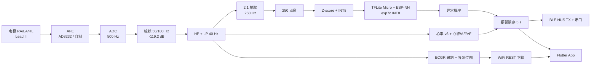

# ESP32-ECG 心电采集与 AI 异常检测系统

> **ESP32-S3 · ESP-IDF · TFLite Micro + ESP-NN · exp7c INT8 · BLE NUS · Flutter**  
> [English](README.en.md) | 中文

**便携式单导联（Lead II）心电采集 + 板载深度学习逐拍异常检测。** 500 Hz 采样，片上完成滤波、心率检测与异常推理，异常经 BLE 推送手机 App，数据以 ECGR 格式板载录制并支持 WiFi 下载。

> **固件线状态（2026-09-01）**：官方固件为 **ESP-IDF 迁移工程** `experiments/esp_idf_ecg_migration/`（2026-08-28 转正，含 AI/存储/WiFi/BLE/心率/规则组件与录制链）。旧 **Arduino + PlatformIO** 线已归档至 `legacy_arduino/`，仅作历史参考。

---

## 特性

| 类别 | 内容 |
|------|------|
| 采集 | 500 Hz 三通道（clean / noisy / filtered），信号源：模拟发生器 / 真实 AFE / MIT-BIH 回放 |
| 滤波 | 双级梳状（50/100 Hz 陷零，-119.2 dB）→ HP → LP 40 Hz |
| 心率 | 能量包络 QRS 检测 v6（LUDB：F1 0.868、Se 96.4%、BPM MAE 4.16） |
| AI | exp7c ResNet-L INT8（167,376 B），TFLite Micro + ESP-NN 推理，逐拍异常检测 |
| 心律 | 停搏 / 过缓 / 过速（规则）、房颤（CV+熵）、VF/VT（DSP 特征+LR） |
| 报警 | 5 s 锁存，BLE/串口 abnormal 标志 + 异常位图 |
| 记录 | ECGR 格式（32B 头 + int16 流 + 1 B/s 异常位图），异常触发自动录制，WiFi REST 下载 |
| 通信 | BLE NUS（TX/RX）+ WiFi HTTP；手机端 Flutter App |

---

## 快速开始

```bash
# —— 官方固件（ESP-IDF v6）——
cd experiments/esp_idf_ecg_migration
idf.py build              # 编译
idf.py -p <PORT> flash    # 烧录
idf.py monitor            # 串口监视

# —— 旧 Arduino 线（仅历史）——
cd legacy_arduino && pio run

# —— PC 绘图 / 手机 App ——
python pc_tools/ecg_plotter.py
cd ecg_app && flutter run
```

> ⚠️ AI 模型训练需 GPU（WSL2）。

---

## 架构



- **核心分工**：Core 1 = 采集/滤波/通信/存储；Core 0 = AI 推理（250 点窗，AI_STRIDE=250）。
- **数据流**：500Hz → 因果滤波 → 2:1 抽取 → 250 点窗 → 归一化 → INT8 → 推理 → 反量化取异常概率。

---

## 目录结构

```
experiments/esp_idf_ecg_migration/  # 官方 IDF 固件线
  main/                            # 主程序（采样/滤波/心率/报警/记录/BLE/WiFi）
  components/                      # ecg_ai · ecg_core · ecg_ble · ecg_wifi · ecg_storage · ecg_afe
                                   # + esp-tflite-micro · esp-nn（vendored）
legacy_arduino/                    # 旧 Arduino/PlatformIO 线（已归档）
pc_tools/                          # PC 工具：ecg_plotter + ecg_dl（训练/评估/导出）
ecg_app/                           # Flutter 手机 App
web/                               # Web 记录下载前端
docs/                              # 论文与结果文档（权威数字：docs/FINAL_RESULTS.md）
test/                              # 测试代码
papers/                            # 文献
```

---

## AI 模型与指标

**板上模型**：exp7c（ResNet-L，~80K 参数），INT8 **167,376 B**，2026-08-14 上板。论文口径最优操作点 beat θ≈0.35 / patient θ≈0.5；**固件运行 θ=0.60 + 5 拍确认**。

| 口径 | 模型 | MIT-AUC | MIT-R@0.5 | PTB-AUC | PTB-R@0.5 |
|------|------|:---:|:---:|:---:|:---:|
| 患者级清洁/未增强测试 | exp5 | 0.9295 | 0.9264 | 0.7845 | 0.6281 |
| 患者级清洁/未增强测试 | exp6 | 0.8942 | 0.9194 | **0.8232** | 0.7019 |
| 跨域参考（无 PTB 训练） | P2A | **0.9878** | 0.9312 | 0.7502 | 0.2552 |
| 部署链（D3，δ 对齐） | exp6-SGD | 0.9122 | 0.9102 | 0.7697 | 0.7069 |

> 两表口径不同（患者级清洁/未增强 vs 部署链 D3），不可直接比较。

---

## 工具链

- **PC 绘图** `pc_tools/ecg_plotter.py`：实时三通道波形 + AI 异常标签（可打包 ECG-Plotter.exe）。
- **深度学习** `pc_tools/ecg_dl/`：训练 / INT8 导出 / 评估（患者级无泄漏划分 + SplitGuard 守卫）。
- **手机 App** `ecg_app/`：BLE NUS 波形显示、AI 高亮报警、记录列表/回放。

---

## 文档

面向用户的说明见各子项目 `README.md`（`pc_tools/ecg_dl/`、`ecg_app/`、`web/`、`experiments/`）。

---

## 许可

[MIT](LICENSE)
